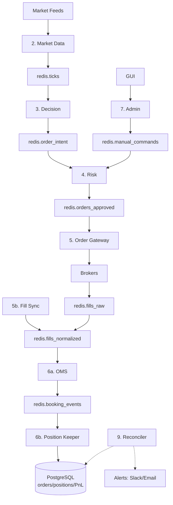

# Solo Runner Trading System Architecture

**Status:** Production-ready for 1 person, 1000s orders/day, multi-broker  
**Date:** Feb 2026  
**Tech:** Docker + PostgreSQL + Redis streams

## 🏗️ Services (10 total)

| # | Service | Input | Output | Purpose |
|---|---------|-------|--------|---------|
| 1 | Docker | - | All services | Container orchestration |
| 2 | Market Data | Feeds | `redis.ticks` → DB | Live + historical prices |
| 3 | Decision | `redis.ticks` + DB | `redis.order_intent` | Strategy signals |
| 4 | Risk | `redis.order_intent` | `redis.orders_approved` | Pre-trade checks |
| 5 | Order Gateway | `redis.orders_approved` | Brokers → `redis.fills_raw` | Broker APIs |
| 5b | Fill Sync | Broker APIs | `redis.fills_normalized` | Position reconciliation |
| 6a | OMS | `redis.fills_*` | `redis.booking_events` → DB | Order lifecycle |
| 6b | Position Keeper | `redis.booking_events` | DB positions/PnL | Continuous aggregation |
| 7 | Admin | GUI streams | `redis.manual_commands` | Manual intervention |
| 8 | Heartbeat Monitor | `redis.heartbeats` | Kill/restart | Service health |
| 9 | Reconciler | DB vs Broker | Alerts | Drift detection |
| 10 | Kill Switch | `redis.kill_switch` | Emergency halt | Safety brake |

## 📊 Data Flow



## 🔴 Redis Streams (8 total)

| Stream | Producer | Consumer | Payload |
|--------|----------|----------|---------|
| `redis.ticks` | Market Data | Decision | `{"symbol", "bid", "ask", "ts"}` |
| `redis.order_intent` | Decision | Risk | `{"order_id", "side", "qty", "price"}` |
| `redis.orders_approved` | Risk | Order Gateway | `+ "risk_score"` |
| `redis.fills_raw` | Order Gateway | Fill Sync | `{"broker_fill_id", "exec_qty"}` |
| `redis.fills_normalized` | Fill Sync | OMS | `+ "order_id"` |
| `redis.booking_events` | OMS | Position Keeper | `{"status", "filled_qty"}` |
| `redis.heartbeats` | All services | Heartbeat Monitor | `{"service", "lag_ms"}` |
| `redis.kill_switch` | Admin | All services | `{"action": "halt"}` |
| `redis.manual_commands` | Admin | Risk/OMS | Manual orders/fixes |

## 💾 Storage

**PostgreSQL (Canonical State)**
```
orders, fills, positions, pnl, configs, risk_limits
```

**Redis (Live State)**
```
- Event streams (above)
- Live ticks (TTL 1hr)
- Heartbeats (TTL 5min)
```

## 🧪 Daily Ops Checklist (5min)

```bash
# Service health
docker ps -a | grep Up

# Stream backlogs  
redis-cli xinfo streams *

# Position drift
SELECT reconciler_last_drift FROM dashboard;

# Test kill switch
redis-cli xadd redis.kill_switch * action test
```

## 🚨 Emergency Recovery (15min)

```bash
1. docker-compose down
2. pg_dump restore latest
3. docker-compose up -d
4. Replay redis streams → rebuild positions
5. Test manual order roundtrip
```

## 🎯 Implementation Priority

```
Week 1: 8. Heartbeat Monitor
Week 2: 9. Reconciler  
Week 3: 10. Kill Switch
Week 4: Split 6 → 6a+6b
```

## 📈 Scale Limits (Solo)

✅ **1000s orders/day**  
✅ **10+ brokers**  
✅ **100+ strategies**  
✅ **Multi-asset (FX/Equities/Crypto)**  

